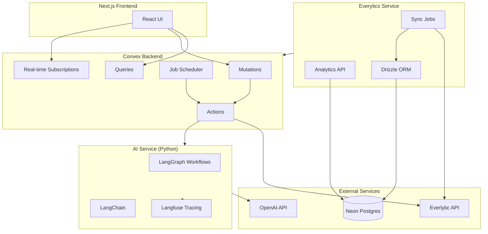
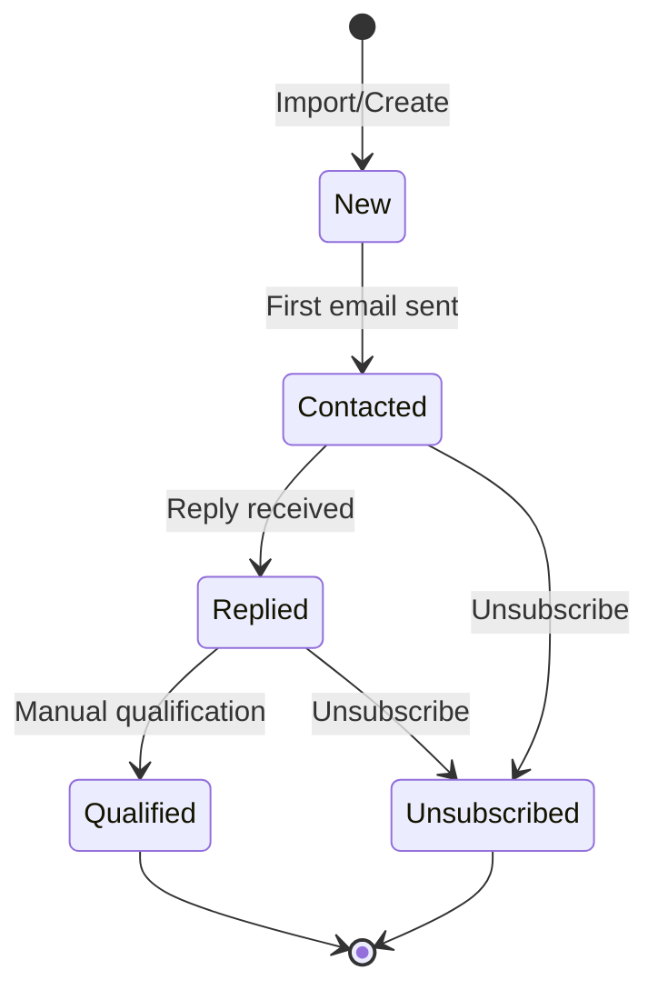
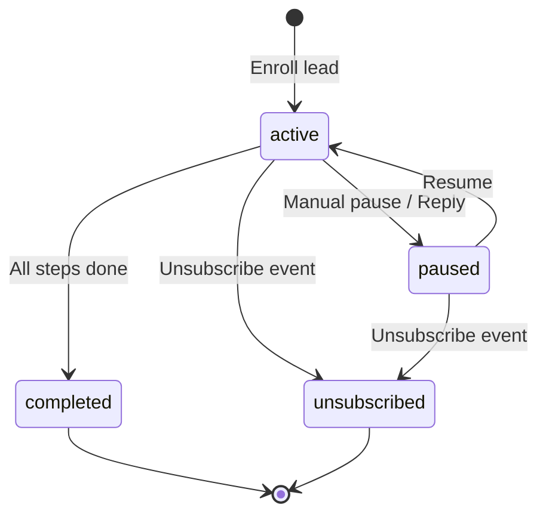

# Design Document: SalesMatter Backend

## Overview

The SalesMatter backend is a distributed system comprising four main components that work together to power a B2B outreach automation platform. The architecture prioritizes real-time responsiveness, multi-tenant isolation, reliable email delivery, and comprehensive AI observability.

### System Components

1. **Convex Backend** - Real-time state management, business logic, and job scheduling
2. **Everytics Service** - Analytics aggregation layer between Everlytic and SalesMatter
3. **Everlytic Integration** - External email delivery and tracking
4. **AI Orchestration Service** - Python-based LLM workflows with Langfuse tracing

## Architecture



## Components and Interfaces

### 1. Convex Backend

#### Collections Schema

```typescript
// convex/schema.ts
import { defineSchema, defineTable } from "convex/server";
import { v } from "convex/values";

export default defineSchema({
  // Multi-tenant
  accounts: defineTable({
    name: v.string(),
    createdAt: v.number(),
  }),
  
  users: defineTable({
    accountId: v.id("accounts"),
    email: v.string(),
    name: v.string(),
    role: v.union(v.literal("admin"), v.literal("member")),
    createdAt: v.number(),
  }).index("by_account", ["accountId"])
    .index("by_email", ["email"]),
  
  workspaces: defineTable({
    accountId: v.id("accounts"),
    name: v.string(),
    settings: v.object({
      defaultFromName: v.string(),
      defaultFromEmail: v.string(),
      timezone: v.string(),
    }),
    createdAt: v.number(),
    deletedAt: v.optional(v.number()),
  }).index("by_account", ["accountId"]),
  
  // Lead Management
  lead_lists: defineTable({
    workspaceId: v.id("workspaces"),
    name: v.string(),
    sourceFilename: v.optional(v.string()),
    leadCount: v.number(),
    createdAt: v.number(),
    deletedAt: v.optional(v.number()),
  }).index("by_workspace", ["workspaceId"])
    .index("by_workspace_created", ["workspaceId", "createdAt"]),
  
  leads: defineTable({
    workspaceId: v.id("workspaces"),
    leadListId: v.optional(v.id("lead_lists")),
    firstName: v.string(),
    lastName: v.string(),
    email: v.string(),
    company: v.string(),
    role: v.string(),
    segment: v.union(v.literal("Enterprise"), v.literal("Mid-Market"), v.literal("SMB")),
    status: v.union(
      v.literal("New"),
      v.literal("Contacted"),
      v.literal("Replied"),
      v.literal("Qualified"),
      v.literal("Unsubscribed")
    ),
    customFields: v.optional(v.any()),
    lastActivityAt: v.number(),
    createdAt: v.number(),
    updatedAt: v.number(),
    deletedAt: v.optional(v.number()),
  }).index("by_workspace", ["workspaceId"])
    .index("by_workspace_status", ["workspaceId", "status"])
    .index("by_lead_list", ["leadListId"])
    .index("by_email", ["workspaceId", "email"]),
  
  // Sequences
  sequences: defineTable({
    workspaceId: v.id("workspaces"),
    name: v.string(),
    status: v.union(v.literal("Draft"), v.literal("Active"), v.literal("Paused")),
    createdAt: v.number(),
    updatedAt: v.number(),
    deletedAt: v.optional(v.number()),
  }).index("by_workspace", ["workspaceId"])
    .index("by_workspace_status", ["workspaceId", "status"]),
  
  sequence_steps: defineTable({
    sequenceId: v.id("sequences"),
    order: v.number(),
    delayDays: v.number(),
    delayHours: v.number(),
    subject: v.string(),
    bodyTemplate: v.string(),
    createdAt: v.number(),
    updatedAt: v.number(),
  }).index("by_sequence", ["sequenceId"])
    .index("by_sequence_order", ["sequenceId", "order"]),
  
  // Enrollments
  lead_enrollments: defineTable({
    workspaceId: v.id("workspaces"),
    leadId: v.id("leads"),
    sequenceId: v.id("sequences"),
    currentStepOrder: v.number(),
    status: v.union(
      v.literal("active"),
      v.literal("paused"),
      v.literal("completed"),
      v.literal("replied"),
      v.literal("unsubscribed")
    ),
    enrolledAt: v.number(),
    completedAt: v.optional(v.number()),
  }).index("by_workspace", ["workspaceId"])
    .index("by_lead", ["leadId"])
    .index("by_sequence", ["sequenceId"])
    .index("by_status", ["workspaceId", "status"]),
  
  // Email Drafts
  email_drafts: defineTable({
    workspaceId: v.id("workspaces"),
    leadId: v.id("leads"),
    enrollmentId: v.optional(v.id("lead_enrollments")),
    sequenceStepId: v.optional(v.id("sequence_steps")),
    subject: v.string(),
    body: v.string(),
    status: v.union(
      v.literal("pending"),
      v.literal("drafted"),
      v.literal("reviewed"),
      v.literal("sent"),
      v.literal("failed")
    ),
    everlyticMessageId: v.optional(v.string()),
    errorReason: v.optional(v.string()),
    createdAt: v.number(),
    sentAt: v.optional(v.number()),
  }).index("by_workspace", ["workspaceId"])
    .index("by_lead", ["leadId"])
    .index("by_status", ["workspaceId", "status"]),
  
  // Email Events (synced from Everytics)
  email_events: defineTable({
    workspaceId: v.id("workspaces"),
    draftId: v.id("email_drafts"),
    everlyticMessageId: v.string(),
    eventType: v.union(
      v.literal("sent"),
      v.literal("delivered"),
      v.literal("opened"),
      v.literal("clicked"),
      v.literal("bounced"),
      v.literal("complained"),
      v.literal("unsubscribed")
    ),
    eventData: v.optional(v.any()),
    occurredAt: v.number(),
    syncedAt: v.number(),
  }).index("by_draft", ["draftId"])
    .index("by_workspace", ["workspaceId"])
    .index("by_everlytic_id", ["everlyticMessageId"]),
  
  // Scheduled Jobs
  scheduled_jobs: defineTable({
    workspaceId: v.id("workspaces"),
    jobType: v.union(
      v.literal("send_email"),
      v.literal("generate_draft"),
      v.literal("sync_analytics")
    ),
    payload: v.any(),
    scheduledFor: v.number(),
    status: v.union(
      v.literal("pending"),
      v.literal("running"),
      v.literal("completed"),
      v.literal("failed")
    ),
    attempts: v.number(),
    lastError: v.optional(v.string()),
    createdAt: v.number(),
    completedAt: v.optional(v.number()),
  }).index("by_status_scheduled", ["status", "scheduledFor"])
    .index("by_workspace", ["workspaceId"]),
});
```

#### Key Mutations

```typescript
// convex/leads.ts - Example mutation interface
export const createLead = mutation({
  args: {
    workspaceId: v.id("workspaces"),
    firstName: v.string(),
    lastName: v.string(),
    email: v.string(),
    company: v.string(),
    role: v.string(),
    segment: v.union(v.literal("Enterprise"), v.literal("Mid-Market"), v.literal("SMB")),
    leadListId: v.optional(v.id("lead_lists")),
  },
  handler: async (ctx, args) => {
    // Validate workspace access
    // Create lead with timestamps
    // Return lead ID
  },
});
```

### 2. Everytics Service (TypeScript/Drizzle)

#### Neon Schema

```typescript
// everytics/src/db/schema.ts
import { pgTable, uuid, varchar, integer, timestamp, real, jsonb } from "drizzle-orm/pg-core";

export const campaigns = pgTable("campaigns", {
  id: uuid("id").primaryKey().defaultRandom(),
  workspaceId: varchar("workspace_id", { length: 255 }).notNull(),
  everlyticCampaignId: varchar("everlytic_campaign_id", { length: 255 }).notNull(),
  name: varchar("name", { length: 255 }),
  createdAt: timestamp("created_at").defaultNow(),
  updatedAt: timestamp("updated_at").defaultNow(),
});

export const deliveryStats = pgTable("delivery_stats", {
  id: uuid("id").primaryKey().defaultRandom(),
  campaignId: uuid("campaign_id").references(() => campaigns.id),
  sent: integer("sent").default(0),
  delivered: integer("delivered").default(0),
  hardBounce: integer("hard_bounce").default(0),
  softBounce: integer("soft_bounce").default(0),
  complaints: integer("complaints").default(0),
  syncedAt: timestamp("synced_at").defaultNow(),
});

export const engagementStats = pgTable("engagement_stats", {
  id: uuid("id").primaryKey().defaultRandom(),
  campaignId: uuid("campaign_id").references(() => campaigns.id),
  opens: integer("opens").default(0),
  uniqueOpens: integer("unique_opens").default(0),
  clicks: integer("clicks").default(0),
  uniqueClicks: integer("unique_clicks").default(0),
  clickToOpenRate: real("click_to_open_rate"),
  syncedAt: timestamp("synced_at").defaultNow(),
});

export const unsubscribeStats = pgTable("unsubscribe_stats", {
  id: uuid("id").primaryKey().defaultRandom(),
  campaignId: uuid("campaign_id").references(() => campaigns.id),
  unsubscribes: integer("unsubscribes").default(0),
  unsubscribeRate: real("unsubscribe_rate"),
  syncedAt: timestamp("synced_at").defaultNow(),
});

export const timelineEvents = pgTable("timeline_events", {
  id: uuid("id").primaryKey().defaultRandom(),
  campaignId: uuid("campaign_id").references(() => campaigns.id),
  eventType: varchar("event_type", { length: 50 }).notNull(),
  eventCount: integer("event_count").default(0),
  eventDate: timestamp("event_date").notNull(),
  syncedAt: timestamp("synced_at").defaultNow(),
});

export const workspaceAggregates = pgTable("workspace_aggregates", {
  id: uuid("id").primaryKey().defaultRandom(),
  workspaceId: varchar("workspace_id", { length: 255 }).notNull(),
  periodStart: timestamp("period_start").notNull(),
  periodEnd: timestamp("period_end").notNull(),
  totalSent: integer("total_sent").default(0),
  totalDelivered: integer("total_delivered").default(0),
  totalOpened: integer("total_opened").default(0),
  totalClicked: integer("total_clicked").default(0),
  totalReplied: integer("total_replied").default(0),
  totalBounced: integer("total_bounced").default(0),
  openRate: real("open_rate"),
  clickRate: real("click_rate"),
  replyRate: real("reply_rate"),
  bounceRate: real("bounce_rate"),
  syncedAt: timestamp("synced_at").defaultNow(),
});
```

#### Everytics API Interface

```typescript
// everytics/src/api/routes.ts
interface EveryticsCampaignMetrics {
  campaignId: string;
  sent: number;
  delivered: number;
  opened: number;
  clicked: number;
  replied: number;
  bounced: number;
  openRate: number;
  clickRate: number;
  replyRate: number;
  bounceRate: number;
}

interface EveryticsTimeSeriesData {
  date: string;
  sent: number;
  opened: number;
  replied: number;
}

// GET /api/metrics/:workspaceId/campaigns/:campaignId
// GET /api/metrics/:workspaceId/timeseries?start=&end=
// GET /api/metrics/:workspaceId/aggregate
```

### 3. AI Orchestration Service (Python)

#### Project Structure

```
ai-service/
├── pyproject.toml
├── src/
│   ├── __init__.py
│   ├── main.py
│   ├── config.py
│   ├── graphs/
│   │   ├── __init__.py
│   │   ├── csv_mapping.py
│   │   ├── email_generation.py
│   │   └── intent_classification.py
│   ├── nodes/
│   │   ├── __init__.py
│   │   ├── csv_parser.py
│   │   ├── field_mapper.py
│   │   ├── email_writer.py
│   │   └── intent_classifier.py
│   ├── prompts/
│   │   ├── __init__.py
│   │   ├── mapping_prompt.py
│   │   ├── email_prompt.py
│   │   └── classification_prompt.py
│   └── tracing/
│       ├── __init__.py
│       └── langfuse_wrapper.py
```

#### LangGraph Workflow Example

```python
# ai-service/src/graphs/csv_mapping.py
from langgraph.graph import StateGraph, END
from langfuse.decorators import observe
from typing import TypedDict, List

class CSVMappingState(TypedDict):
    headers: List[str]
    sample_rows: List[dict]
    suggested_mappings: dict
    workspace_id: str
    user_id: str
    trace_id: str

@observe(name="csv_mapping_graph")
def create_csv_mapping_graph():
    graph = StateGraph(CSVMappingState)
    
    graph.add_node("parse_headers", parse_headers_node)
    graph.add_node("analyze_samples", analyze_samples_node)
    graph.add_node("suggest_mappings", suggest_mappings_node)
    
    graph.set_entry_point("parse_headers")
    graph.add_edge("parse_headers", "analyze_samples")
    graph.add_edge("analyze_samples", "suggest_mappings")
    graph.add_edge("suggest_mappings", END)
    
    return graph.compile()
```

#### Langfuse Integration

```python
# ai-service/src/tracing/langfuse_wrapper.py
from langfuse import Langfuse
from langfuse.decorators import observe, langfuse_context
from functools import wraps

langfuse = Langfuse()

def traced_llm_call(name: str, metadata: dict = None):
    def decorator(func):
        @wraps(func)
        @observe(name=name)
        async def wrapper(*args, **kwargs):
            langfuse_context.update_current_observation(
                metadata=metadata or {}
            )
            result = await func(*args, **kwargs)
            return result
        return wrapper
    return decorator
```

### 4. Everlytic Integration

#### API Client Interface

```typescript
// convex/everlytic/client.ts
interface EverlyticConfig {
  apiKey: string;
  baseUrl: string;
}

interface SendEmailRequest {
  to: string;
  fromName: string;
  fromEmail: string;
  subject: string;
  htmlBody: string;
  trackOpens: boolean;
  trackClicks: boolean;
  metadata: Record<string, string>;
}

interface SendEmailResponse {
  messageId: string;
  status: "queued" | "sent" | "failed";
  error?: string;
}

interface CampaignReport {
  campaignId: string;
  sent: number;
  delivered: number;
  opens: number;
  uniqueOpens: number;
  clicks: number;
  uniqueClicks: number;
  bounces: number;
  unsubscribes: number;
  complaints: number;
}
```

## Data Models

### Lead Lifecycle States



### Enrollment Lifecycle



